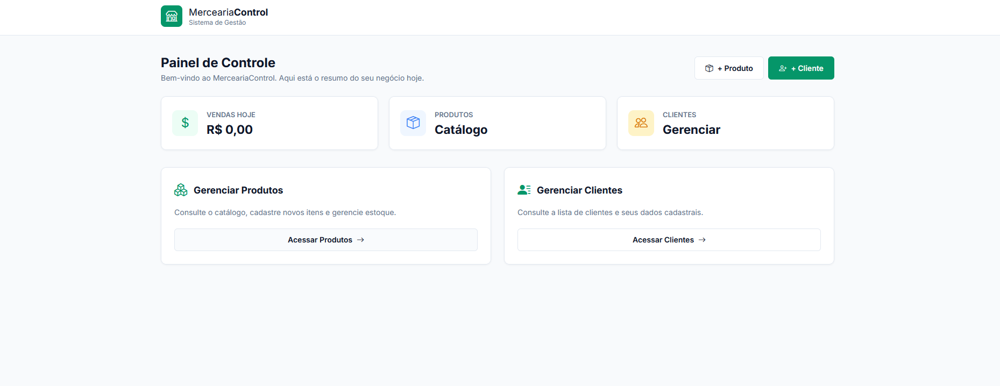
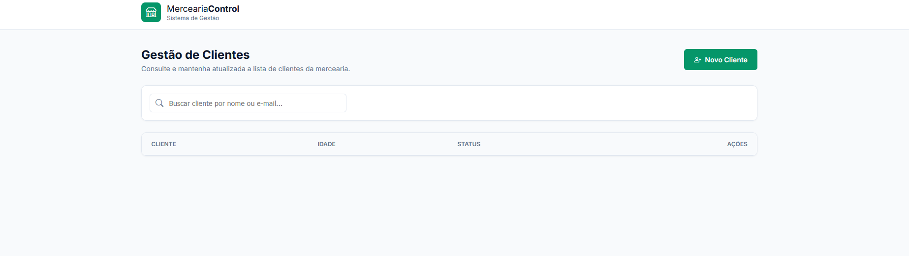
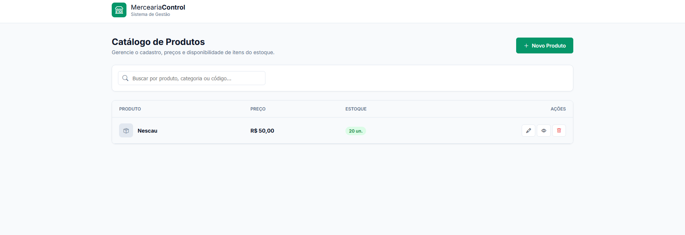

# 🛒 MerceariaMVC

Uma aplicação web completa para gerenciamento de clientes e estoque de produtos para mercearias, desenvolvida no padrão de arquitetura **MVC (Model-View-Controller)** com **ASP.NET Core**.

---

## 🛠️ Tecnologias Utilizadas


---

## 📌 Sumário

- [📖 Sobre o Projeto](#-sobre-o-projeto)
- [👨‍🎓 Autoria e Orientação](#-autoria-e-orientação)
- [✨ Funcionalidades](#-funcionalidades)
- [📸 Capturas de Tela](#-capturas-de-tela)
- [🗄️ Configuração do Banco de Dados](#️-configuração-do-banco-de-dados)
- [▶️ Como Executar](#️-como-executar)
- [📁 Estrutura do Projeto](#-estrutura-do-projeto)

---

## 📖 Sobre o Projeto

O **MerceariaMVC** é uma solução robusta para cadastro, controle e gerenciamento de **Clientes** e **Produtos**. O sistema conta com uma interface responsiva, intuitiva e moderna, permitindo a realização do fluxo CRUD completo (Criar, Ler, Atualizar e Deletar), além de controlar estoque em tempo real e aplicar regras de negócio diretamente no servidor via Entity Framework Core.

---

## 👨‍🎓 Autoria e Orientação

- **Aluno / Desenvolvedor:** Guilherme Pereira Dantas de Oliveira Santos
- **Professor / Orientador:** Wallace Oliveira dos Santos

---

## ✨ Funcionalidades

### 👥 Módulo de Clientes
- Cadastro completo de clientes (Nome, E-mail, Idade e Status).
- Controle de status ativo/inativo para permissões no sistema.
- Validação de dados do cliente diretamente na Model/Controller.
- Listagem organizada, consulta de detalhes, edição e remoção.

### 📦 Módulo de Produtos
- Cadastro detalhado do catálogo com Nome, Preço e Quantidade.
- Controle automatizado de estoque com alerta visual de quantidade baixa.
- Operações de edição, atualização de saldo de estoque e exclusão de itens.

---

## 📸 Capturas de Tela

### 🏠 Painel Inicial (Dashboard)


---

### 📍 Módulos do Sistema

| Gestão de Clientes | Gestão de Produtos |
| :---: | :---: |
|  |  |

---

## 🗄️ Configuração do Banco de Dados

A aplicação utiliza o **SQL Server** com a abordagem **EF Core Code First**.

Configure sua string de conexão no arquivo `appsettings.json` dentro da pasta `MerceariaMVC`:

```json
{
  "ConnectionStrings": {
    "DefaultConnection": "Server=localhost;Database=dbMerceariaMVC;Trusted_Connection=True;TrustServerCertificate=True;"
  }
}
